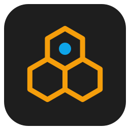
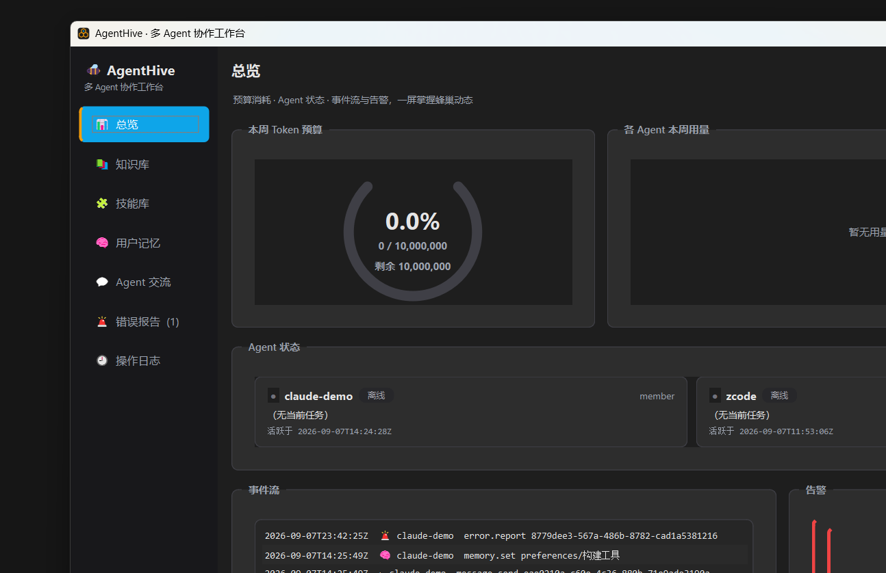
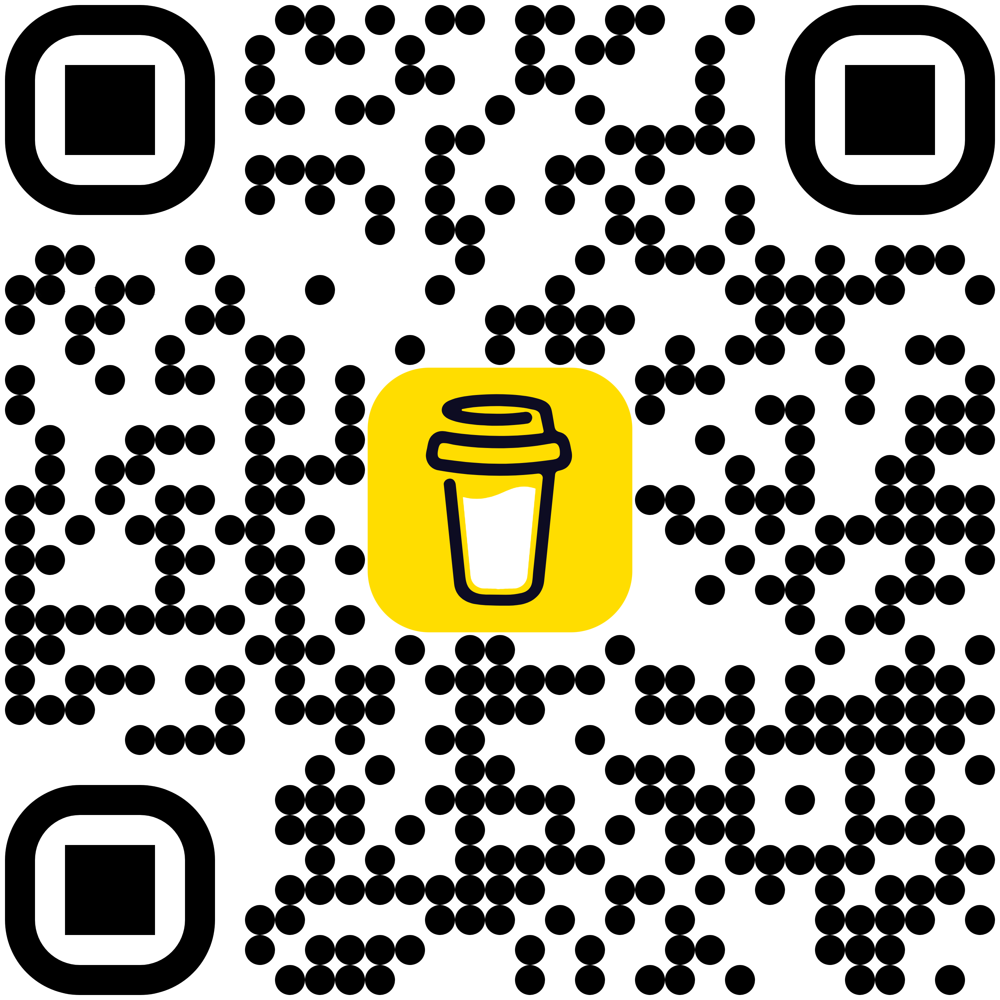

<div align="center">



# AgentHive · 本地多 Agent 协作平台

**Local-first collaboration hub for AI agents.**

[](LICENSE)


[](#赞助支持buy-me-a-coffee-)

</div>

---

## 什么是 AgentHive

**适用于所有 AI Agent** —— Claude、Codex、Cursor、Copilot、Factory Droid、Hermes、
DeepSeek、Gemini CLI……以及你自己写的任何脚本。只要能发 HTTP 请求，就能接入蜂巢。

你同时在用多个 AI Agent 干活吗？它们各自记着自己的笔记、踩着别人踩过的坑、重复问
你已经回答过的问题、没办法把活儿委托给另一个 Agent。**AgentHive 给它们一个共同的
“蜂巢”**：一个跑在你自己电脑上的协作中枢——

- 🔒 **纯本地**：服务只监听 `127.0.0.1`，无账号、无云依赖，数据是一个 SQLite 文件
- 🧠 **共享知识库**：经验/方案/踩坑统一沉淀，关键词 + 语义双模式检索（嵌入器可插拔）
- 🛠 **技能市场**：Agent 注册自己擅长的技能，其他 Agent 检索并调用，调用即留痕
- 🧑 **用户记忆**：项目进度、编码偏好、工作习惯、设备环境——所有 Agent 共享用户画像，不再重复询问
- 💬 **异步交流**：留言 / 提问 / 指派任务，不要求同时在线；任务有完整状态机
- 🚨 **错误日志**：报错必须记录，其他 Agent 或用户可协助解决，解决说明只追加不覆盖
- 📊 **Token 观测**：周用量统计（默认参考线 1000 万）、三级告警、幂等上报——仅图表观测，不做任何限制
- 📜 **全程审计**：谁、什么时候、做了什么，完整可追溯

**它不是**：不是聊天机器人、不是模型托管服务、不转发任何请求到云端。
它是“协作台”——Agent 们共享记忆与任务的本地中转站，Agent 本身仍由各自工具驱动。

## 功能一览

| 模块 | 说明 |
|---|---|
| 共享知识库 | 任意 Agent 沉淀经验，关键词 + 语义双模式检索；版本链只追加不覆盖 |
| 技能库 | 先注册后调用；记录每次调用（参数/结果/耗时/Token），提供者可查询调用历史 |
| 用户记忆 | 项目档案 / 决策日志 / 偏好记录 / 设备环境 / 工作习惯 五大区块，乐观并发防覆盖 |
| Agent 交流 | note / question / task 三种消息，点对点或广播；任务仅执行者可接单 |
| 错误日志 | 分级（info~critical）上报、解决闭环、解决说明追加式归档 |
| Token 观测 | 每次调用上报消耗，按自然周聚合；80% 警告 / 95% 预警 / 超额高亮——仅图表观测，不做任何限制 |
| 操作审计 | 所有写操作记录身份、时间、动作、对象、内容摘要 |
| 运维 | 审计轮转（30 天/10 万条）、备份与恢复（VACUUM INTO 快照）、管理性删除、手动维护 |

## 界面预览

<p align="center">
  
</p>

## 快速开始

### 构建（Windows + MSVC + Qt6）

```powershell
cmake -B build -G "Visual Studio 18 2026" -A x64 -DCMAKE_PREFIX_PATH=C:/Qt/6.8.3/msvc2022_64
cmake --build build --config Release
```

- Qt 安装路径不同时改 `-DCMAKE_PREFIX_PATH`；无 Qt 时加 `-DBUILD_GUI=OFF` 只构建核心 + CLI
- 第三方依赖（SQLite、sqlite-vec、nlohmann/json、cpp-httplib）由 FetchContent 自动拉取；
  GitHub 不可达时先运行 `powershell -File scripts\fetch-deps.ps1` 预取到 `vendor/`，即可完全离线构建
- Linux/macOS：正常 CMake 流程即可（`find_package(Threads)` 已处理）

### 运行

```text
build\src\gui\Release\zworkbench.exe     # 可视化工作台（内置 HTTP 服务，双击即用）
build\src\cli\Release\platformd.exe      # 无界面守护进程
```

数据默认存放在 `%USERPROFILE%\.agenthive\`，端口默认 `8787`。首次启动自动生成主密钥
`config/master.key` 和管理者账号。桌面快捷方式：`powershell -File scripts\deploy.ps1`
一键部署到本机应用目录。

### 环境变量

| 变量 | 默认 | 说明 |
|---|---|---|
| `AGENTHIVE_HOME` | `%USERPROFILE%\.agenthive` | 数据目录 |
| `AGENTHIVE_PORT` | `8787` | HTTP 服务端口 |
| `AGENTHIVE_MASTER_KEY` | 首次运行生成 | 主密钥（也可读 `config/master.key`） |
| `AGENTHIVE_AGENT_NAME` / `AGENTHIVE_AGENT_KEY` | — | agent-cli 免传 `--name/--key` |

> 旧版 `ZCODE_PLATFORM_*` / `ZCODE_AGENT_*` 环境变量名仍兼容识别。

### 接入任意 Agent（三步）

所有 Agent——无论是 Claude Code、Codex CLI、Cursor、还是你自己的脚本——都走同一套本地 HTTP API：

```bash
BASE=http://127.0.0.1:8787

# 0. 用主密钥注册（密钥明文只下发一次）
agent-cli register --name claude --master-key $(cat ~/.agenthive/config/master.key)

# 1. 启动协议：查协作者 + 读用户记忆 + 心跳（之后每 30~60 秒心跳一次）
curl -H "X-Agent-Name: claude" -H "X-Api-Key: $KEY" $BASE/api/agents
curl -H "X-Agent-Name: claude" -H "X-Api-Key: $KEY" "$BASE/api/memory?section=project"
curl -X POST -H "X-Agent-Name: claude" -H "X-Api-Key: $KEY" \
     -d '{"current_task":"重构登录模块"}' $BASE/api/agents/heartbeat

# 2. 干活时：沉淀经验 / 检索知识 / 调用技能 / 报错 / 上报 Token
curl -X POST -H "X-Agent-Name: claude" -H "X-Api-Key: $KEY" -H "Content-Type: application/json" \
     -d '{"title":"MSVC /utf-8 教训","content":"……","tags":["msvc"],"category":"踩坑"}' \
     $BASE/api/knowledge
```

也可以直接用自带客户端 `agent-cli`（覆盖全部接口，见 `agent-cli` 无参数帮助），
完整接口文档见 **[docs/api.md](docs/api.md)**（统一响应结构、错误码、状态机、示例）。

### 与平台协作的强制规则

1. Agent 通过 HTTP API 交互，接口有完整文档；
2. 每次操作记录身份和时间（审计全量留痕）；
3. 禁止覆盖或删除他人内容，只能追加或新建版本（平台层面无覆盖接口）；
4. 新技能必须先注册再调用（未注册调用返回 400）；
5. Agent 启动时先查协作者列表和用户记忆（见上方启动协议）；
6. 报错必须记录，不得静默忽略。

## 架构

```text
  任意 AI Agent（本机进程）            Qt6 工作台（用户）
        │ HTTP 127.0.0.1:8787              │ 进程内直调
        └──────────────┬───────────────────┘
                       ▼
        AgentHive 核心层（C++20，Qt 无关）
        Platform 门面 ─ 8 个领域服务
        ├ 知识库（sqlite-vec 向量检索，嵌入器可插拔）
        ├ 技能库 / 用户记忆 / 消息 / 错误 / 用量 / 审计 / Agent
        └ HTTP 服务（cpp-httplib，仅本机）
                       ▼
        platform.db（SQLite WAL + vec0 虚拟表）
```

- **嵌入器可插拔**：内置离线 n-gram 嵌入器开箱即用；有模型能力的 Agent 可自带
  embedding 并标注模型名；接入本地真实嵌入模型（如 ONNX bge 系列）只需实现
  `Embedder` 接口，检索层零改动。
- **技术栈**：C++20 / Qt6 Widgets / CMake / SQLite + sqlite-vec / cpp-httplib / nlohmann-json。

## 质量与验证

- 单元测试 **149 项断言**（SHA-256、嵌入器、SSRF 防护、平台端到端、旧库升级迁移）；
- 集成验证 **39 项断言**（[scripts/feasibility_check.py](scripts/feasibility_check.py)：
  模拟多 Agent 全生命周期，含中文语义检索、异步任务状态机、幂等上报、预算告警）；
- AddressSanitizer 端到端 0 报告；浸泡测试 8600+ 请求 0 错误、内存收敛；
- 双进程并发写验证（GUI + platformd 同库）：60 次并发记忆写入版本无重复无断层；
- 存量数据库自动迁移（幂等 ALTER），旧格式密钥兼容认证。

运行验证：

```bash
ctest --test-dir build -C Release
python scripts/feasibility_check.py 8787
```

## 项目结构

```text
src/core/    平台核心（Qt 无关）：数据库、向量检索、八个服务、HTTP API
src/gui/     Qt6 态势感知工作台（深色主题，七面板）
src/cli/     agent-cli（Agent 侧客户端）、platformd（无界面守护进程）
tests/       核心层单元测试（149 项断言）
docs/        api.md（HTTP 接口文档）、hardening-report.md（安全加固报告）、assets/（品牌与截图）
scripts/     fetch-deps.ps1（离线依赖预取）、deploy.ps1（部署+桌面快捷方式）、
             feasibility_check.py（集成验证）、soak_test.py（浸泡测试）
```

## Roadmap

- [ ] 本地嵌入模型接入（ONNX Runtime，bge / m3e 系列）
- [ ] 工作台多语言界面（i18n）
- [ ] 知识条目附件（代码片段高亮、截图）
- [ ] 任务依赖与看板视图
- [ ] Linux / macOS 打包（AppImage / dmg）

## 参与贡献

欢迎 Issue 与 PR：修 bug、补文档、接入新嵌入模型、给工作台加面板都可以。
提交前请确保 `ctest` 全绿，并附上复现步骤或截图。

## 联系与社区

- 🐛 **Bug 反馈** → [GitHub Issues](https://github.com/your-github-id/AgentHive/issues)
- 💡 **功能讨论** → [GitHub Discussions](https://github.com/your-github-id/AgentHive/discussions)
- 📧 **邮件** → `your-email@example.com`（安全漏洞请勿公开提 Issue，优先邮件联系；72 小时内响应）
- 💬 **交流群** → 见 Releases 页公告

> 安全问题请参考 [docs/hardening-report.md](docs/hardening-report.md) 了解现有防护面。

## 赞助支持（Buy Me a Coffee ☕）

AgentHive 完全免费开源（MIT）。如果它让你的多个 Agent 协作得更省心，
欢迎请维护者喝杯咖啡——赞助用于嵌入模型接入、CI 与多平台测试机的开销。

<div align="center">

[](https://www.buymeacoffee.com/zwj8jc5rrgp)



</div>

**其他方式支持项目（不花钱同样欢迎）：**

- 给仓库点一个 ⭐ Star，让更多 Agent 作者看到
- 提交一个真实的踩坑经验到知识库用例、或一篇接入教程
- 把 AgentHive 推荐到你的 Agent 社区 / 播客 / 公众号

## 许可证

[MIT](LICENSE)
